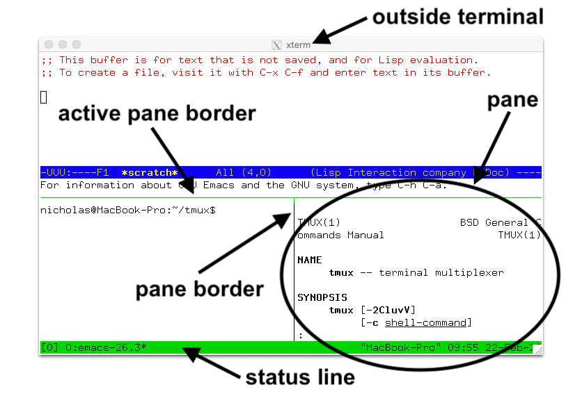
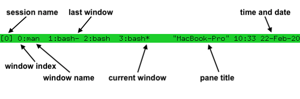

Tmux
=================

tmux is a program which runs in a terminal and allows 
multiple other terminal programs to be run inside it.
Each program inside tmux gets its own terminal managed by tmux,
which can be accessed from the single terminal where tmux is 
running - this called multiplexing and 
tmux is a terminal multiplexer.

The main uses of tmux are to:

- Protect running programs on a remote server from connection drops
    by running them inside tmux.
- Allow programs running on a remote server to be accessed from 
    multiple different local computers.
- Work with multiple programs and shells together in one terminal,
    a bit like a window manager.

TL;DR
-------------------------

#. learn how to use vim to navigate
    - enable vi mode-keys and status-keys
    - enable `vim-tmux-navigator`
#. there are sessions, windows and pane
#. move around with basic control
#. get to know buffer mode and mouse mode, skip other two
#. know 4 keybinding tables and 5 kinds of options

Basic Concepts
--------------------------

Tmux is server-client architecture, so it will generate socket file, 
somewhere in `/tmp` to manage the state of the session. Whenever 
someone attaches to it, then that session is taken over.

There are three hierarchical level for tmux:

- panel: most basic element, each terminal run in one panel
- window: composed of panels to cover the entire window area
- session: grouping multiple windows, and it only displays
    one current window

.. note:: From the control perspective, you should be aware of the
    window index, current window and previous window, so that
    it is easy to navigate in between.

.. csv-table:: Concepts Table
    :file: /_static/tmux_concepts.csv
    :header-rows: 1
    :delim: U+0009

Control
-----------------------

.. note:: One of reason why I can navigate through the
    tmux so efficiently is that I am using the vim binding.

There are two control interface: 

- `tmux <subcommand>`: before you enter the session
    - view key bindings: `tmux lsk -N | more`
- `<prefix> <other key>`: after enter the session
    - `<prefix> ?`

Therefore, it is important to set a prefix key that you
like. And personally, I would say the default `<C-b>` 
is a good pick.

In tmux, modifier keys are shown by prefixing a key with 

- C- for the control key
- M- for the meta key (normally Alt on modern computers)
- S- for the shift key. These may be combined together

.. note:: C-M-x means pressing the control key, meta key and x together.

Basic
^^^^^^^^^^^^^^^^^^^^^^^^^^^

.. note:: 
    Define a good prefix for yourself!!!

    Don't obsess with the shortcut, but just make use of both for 
    efficiency and avoid mis-manipulation

There are two parts: `command after prefix`: command prompt

Session Commands:

- `d`: detach/detach-client
- `$`: rename/rename-session

Window Commands:

- `,`: rename-window
- `%`: split-window -h
- `"`: split-window -vertically

Pane Commands:

- `{` and `}`: move pane clockwise and ani-clockwise
    - swap-panel `[-s src] -t dst` 
- `M-up/down/left/right`: resize pane at that direction

Other Commands:

- `?`: help for sure
- `:`: command prompt
- : new-session
- : attach-session
- : ls/list
- `[0-9]`: change to window X
- `q`: display-pane

Status Line
-----------------------

There are four parts in the status line, while there are window index and window name
for each window.

Tree Mode
------------------------

Tree Mode is a ways to view session, windows and panel.

There are two entrypoints:

- `<prefix> s`: show all sessions
- `<prefix> w`: show all windows in the current session while 
    displaying other sessions name

Client Mode
------------------------

Client Mode is similar to Tree Mode, but it is classifying
by client, which is a pseudo tty, while tree mode is classified
with different sessions

You can enter by `<prefix> S-d`

Buffer Mode
---------------------------

It looks the same as tree mode, except it is for selecting different
buffers, which contain the text copied from copy mode.

- `[`: enter Copy Mode
- `]`: paste things in buffer
    - with the same vim control with vim enabled
- `=`: enter Buffer Mode

Also, it is possible to load and save to file to/from buffer with:

- saveb -b <buffer name> <filename>
- loadb -b <buffer name> <filename>

Mouse Mode
-------------------------

Features of Mouse Mode:

- activate pane with click in the area
- activate window with click on the tab
- resize pane border
- copy from the selected area of a pane
- [not working] right button with many choices

Configuration with Text
------------------------------------

Key Bindings with `bind-key/unbind-key`
^^^^^^^^^^^^^^^^^^^^^^^^^^^^^^^^^^^^^^^^^^^

.. note:: Without vi mode, the Copy Mode is a nightmare.

    To show key biding use list-key (and specify table)

There are four default key tables (you have to specify with `-T <table name>`):

- The `root` table contains key bindings for keys pressed without the prefix key.
- The `prefix` table contains key bindings for keys pressed after the prefix key, like those mentioned so far in this document.
- The `copy-mode` table contains key bindings for keys used in copy mode with emacs(1)-style keys.
- The `copy-mode-vi` table contains key bindings for keys used in copy mode with vi(1)-style keys.

Show Types of Options
^^^^^^^^^^^^^^^^^^^^^^^^^^^^

Set options to global, effective in both command prompt
and text file: `set -g status off` and `set -gu status` to unset.

.. note:: `Userful Options <https://github.com/tmux/tmux/wiki/Getting-Started#list-of-useful-options>`_
    set-clipboard external

There are several types of options, and you can show them with `tmux show`:

- `-s`: Server options which affect the entire server.
- `-g`: Session options which affect one or all sessions.
- `-wg`: Window options which affect one or all windows.
- Pane options which affect one or all panes.
- User options which are not used by tmux but are reserved for the user.

Style format can be found `here <https://man.openbsd.org/tmux#STYLES>`_.

This style can be applied to status bar etc.

Other Features
-----------------------

Here is the `link <https://github.com/tmux/tmux/wiki/Getting-Started#other-features>`_
to other features:

- alert for process?
- not-listed session, windows and pane options
- move pane with `join-pane` and `break-pane`
- restore/save layout with `select-layout`
- empty pane
- hooks: `set-hook` and `show-hooks`
- sync for script with `wait-for`
